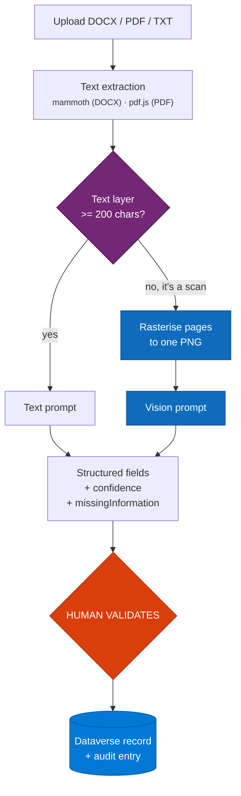

<div align="center">

# Dataverse Document Intelligence

**Prompt-driven document extraction with a user-defined capture schema**

[](#)
[](docs/ai-builder-findings.md)
[](#)
[](LICENSE)

</div>

Extraction into Dataverse with automatic handling of scanned documents, and a human validation gate
before anything is written.

---

## The problem

Document extraction gets rebuilt from scratch on every project, because the capture schema is
hardcoded. Change the fields you want and you're editing prompts, flows and table definitions.

Three failures show up in nearly every build:

**Scanned documents silently return nothing.** A scanned PDF is a picture of a page in a PDF
wrapper - it has no text layer. Text extraction returns an empty string, the prompt receives
nothing, and the model dutifully produces a well-formed result with every field empty. Nothing
errors. The failure is invisible until someone checks a record by hand.

**AI writes straight to the system of record.** No confidence, no indication of what was missing, no
human checkpoint. Governance teams reject this, and they're right to - an extraction that is 90%
accurate across 23 fields is wrong somewhere on nearly every document.

**The schema is somebody's code.** Business users can't change what gets captured, so every new
document type is a development cycle.

## What this solves

| Problem | How this repo solves it |
|---|---|
| Capture schema hardcoded | Configuration UI where users define fields, types and prompts |
| Scanned documents return nothing | Automatic detection, with fallback to a vision prompt |
| No indication of extraction quality | Per-field `confidence` and explicit `missingInformation` |
| AI writes unchecked to Dataverse | Nothing persists until a human confirms |
| Prompt logic drifts between environments | One prompt definition, two runtimes |
| Undocumented AI Builder failures | Four documented findings that each cost real time |

---

## How it works



> Nothing is written to Dataverse before the human validation step. The AI never files a record on
> its own.

The 200-character threshold is what distinguishes a real text layer from the stray whitespace a
scanned PDF sometimes carries.

---

## What's in this repo

**This is an architecture reference and a findings document, not a deployable solution.**

| Included | Not included |
|---|---|
| Text extraction and scan-detection module (`src/documentText.js`) | A running application |
| Prompt builders for text and vision paths (`prompts/extraction.js`) | The configuration UI - **designed, not built** |
| The AI Builder findings, in full | Dataverse tables or solution |
| Configuration data model | Power Automate flows |

The two JavaScript modules are complete and readable, but there is **no build, no tests and no
`package.json`** - they are reference implementations to lift into your own project, not a library
to install.

**The configuration UI described in [docs/configuration.md](docs/configuration.md) is a design.**
The data model and prompt-assembly approach are specified; the UI itself is not in this repo.

**What is genuinely verified** is the findings section below. Those behaviours were established by
testing against AI Builder and each one cost real time to find. That is the part of this repo worth
reading.

---

## Configuration model

Users define the capture schema without touching code - **as designed**; see
[docs/configuration.md](docs/configuration.md) for the data model:
- **Fields** - name, type, whether required
- **Prompt fragment** per field, describing what to look for
- **Validation** - value ranges, allowed values, formats
- **Routing signals** - fields whose values direct the record downstream

Stored in Dataverse, so a new document type would be configuration rather than a release.

---

## Four things that are not obvious

Each of these cost real time to establish, and none is in the documentation. This is the most useful
part of the repo.

### 1. A document input is an object, not a string

`type: 'document'` on a prompt input produces `{ base64Encoded: ... }` in the run data
specification - not a plain `Base64String`. Passing raw base64 to the input itself does nothing
useful.

### 2. `additionalContext` is not the file channel

AI Builder adds an optional `additionalContext` `Base64String` to **every** prompt specification,
including text-only ones. It looks exactly like where a file should go.

It is not. The prompt never reads it, so extraction succeeds and silently returns nothing - the
worst possible failure mode, because there is no error to investigate.

### 3. The value has to be binary

Passing the base64 *string* leaves the platform to encode it a second time, and the service then
sniffs base64 text rather than an image. A valid one-pixel PNG comes back as *"unable to identify
the mimetype"*.

Wrap the trigger value in `base64ToBinary()`. It must be applied to a **trigger value**, not a
literal - a Logic Apps expression is capped at 8192 characters and a page of scan is several
hundred thousand.

### 4. PDF is rejected outright

The prompt answers *"You uploaded an unsupported image"* and lists `png`, `jpeg`, `gif`, `webp` - which contradicts the AI Builder documentation.

So scanned PDFs are rasterised in the browser first: each page drawn to a canvas and stacked into
one tall PNG, keeping it to a single prompt call. **PNG not JPEG**, because JPEG artefacts land on
the thin strokes of small print. Fill the canvas white first, or transparent areas flatten to black
and take the text with them. Capped at eight pages.

### Diagnosing it when it breaks

The app only ever sees a **502 BadGateway** from the connector gateway. The real message is in the
flow run's action output.

`GetPredictionSchema`, which would describe the input directly, returns **404 for GPT prompts** - it is for form processing models only.

To test payload variants, trigger the flow on a **recurrence** rather than from Power Apps. A Power
Apps triggered flow can only be run from the app; a scheduled one can be run on demand, and several
variants can sit in one flow as separate actions so a single run reports on all of them.

---

## Dual-runtime prompts

The prompt wording lives once and is used by two runtimes:

| Runtime | Transport | When it applies |
|---|---|---|
| **AI Builder custom prompts** | Dataverse `msdyn_aimodel` + bound `Predict` | In-platform. Solution-portable, governed by Power Platform, no separate Azure dependency. |
| **Azure OpenAI** | Chat completions | Local development, so the app runs outside Power Apps. |

Because the wording is shared, what you develop against and what ships cannot drift.

### Why both - a documented limitation

AI Builder prompts are the right answer in-platform, but **cannot be invoked from outside the Power
Apps host**. The bound `Predict` action rejects every call with:

```
InvalidRequest: Source is null
```

...regardless of the `source` parameter value, request shape or headers used. Verified against **ten
source values, six header variants and three payload shapes**. The payload itself is correct,
confirmed against the published `PredictionSchema`. The `source` parameter simply does not bind for
a token issued to anything other than the Power Apps client.

Hence the second runtime for local development.

---

## The human validation gate

Nothing is written to Dataverse until a person submits. The AI never files a record on its own.

The extraction returns, alongside the fields:
- **`confidence`** - so low-certainty fields can be highlighted rather than trusted
- **`missingInformation`** - what the document did not contain, so the reviewer knows what to chase

Scanned documents are flagged on the form, because extraction from pages the model read itself
deserves closer checking than a native text layer.

This is what makes the pattern acceptable to a governance review: the AI proposes, a human disposes,
and the audit trail records both.

---

## Contents

| Path | Purpose |
|---|---|
| `prompts/` | Prompt definitions, shared across both runtimes |
| `src/` | Text extraction, scan detection, rasterisation |
| `dataverse/` | Schema for captured records, config and audit |
| `docs/ai-builder-findings.md` | The undocumented behaviours, in full |
| `docs/configuration.md` | Defining a capture schema |

---

## Limitations
- Rasterisation capped at **eight pages** per document.
- Scan detection uses a 200-character threshold - a document with a very short real text layer will
  be treated as a scan.
- AI Builder prompts cannot be called outside the Power Apps host (see above).
- Handwriting is not reliably extracted.
- Findings were established against AI Builder as at 2026 and may change.

## Licence

MIT - see [LICENSE](LICENSE).
