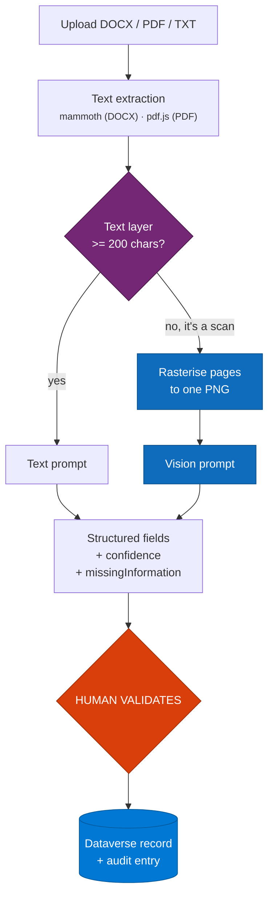

<div align="center">

# Dataverse Document Intelligence

**Prompt-driven document extraction with a user-defined capture schema**

[](#whats-in-this-repo)
[](tests/)
[](#)
[](docs/ai-builder-findings.md)
[](#)
[](#disclaimer)
[](LICENSE)

</div>

Extraction into Dataverse with automatic handling of scanned documents, and a human validation gate
before anything is written.

---

## The problem

Document extraction gets rebuilt from scratch on every project, because the capture schema is
hardcoded. Change the fields you want and you're editing prompts, flows and table definitions.

Three failures show up in nearly every build:

**Scanned documents silently return nothing.** A scanned PDF is a picture of a page in a PDF
wrapper - it has no text layer. Text extraction returns an empty string, the prompt receives
nothing, and the model dutifully produces a well-formed result with every field empty. Nothing
errors. The failure is invisible until someone checks a record by hand.

**AI writes straight to the system of record.** No confidence, no indication of what was missing, no
human checkpoint. Governance teams reject this, and they're right to - an extraction that is 90%
accurate across 23 fields is wrong somewhere on nearly every document.

**The schema is somebody's code.** Business users can't change what gets captured, so every new
document type is a development cycle.

## What the pattern addresses

| Problem | Approach | In this repo |
|---|---|---|
| Capture schema hardcoded | Users define fields, types and prompt fragments as data | Data model and config validation (`validateFieldConfig`). UI designed, not built |
| Scanned documents return nothing | Detect a missing text layer and fall back to a vision prompt | Implemented and unit tested |
| No indication of extraction quality | Per-field `confidence` and explicit `missingInformation` | Prompt contract plus `validateExtractionResult`, which enforces it in code |
| Model output trusted as-is | Unknown fields dropped, choices checked, low confidence flagged | Implemented and unit tested |
| Instructions hidden in a document | Document treated as data, fenced, never as instructions | Prompt rule plus `wrapDocumentText` |
| AI writes unchecked to Dataverse | Nothing persists until a human confirms | Designed. The validation form is not in this repo |
| Prompt logic drifts between environments | One prompt definition, two runtimes | Implemented |
| AI Builder behaviours that are easy to miss | Dated findings, each with the symptom it produces | [Findings](docs/ai-builder-findings.md) |

---

## How it works


```mermaid
flowchart TD
    A["Upload DOCX / PDF / TXT"] --> B["Text extraction<br/><small>mammoth (DOCX) · pdf.js (PDF)</small>"]
    B --> C{"Text layer<br/>>= 200 chars?"}

    C -->|yes| D["Text prompt"]
    C -->|"no, it's a scan"| E["Rasterise pages<br/>to one PNG"]
    E --> F["Vision prompt"]

    D --> G["Structured fields<br/>+ confidence<br/>+ missingInformation"]
    F --> G

    G --> H{"HUMAN VALIDATES"}
    H --> I[("Dataverse record<br/>+ audit entry")]

    style C fill:#742774,stroke:#4A184A,color:#fff
    style E fill:#0F6CBD,stroke:#0A4E8A,color:#fff
    style F fill:#0F6CBD,stroke:#0A4E8A,color:#fff
    style H fill:#D93F0B,stroke:#9E2E08,color:#fff
    style I fill:#0078D4,stroke:#005A9E,color:#fff
```

> Nothing is written to Dataverse before the human validation step. The AI never files a record on
> its own.

The 200-character threshold is what distinguishes a real text layer from the stray whitespace a
scanned PDF sometimes carries.

---

## What's in this repo

**This is an architecture reference and a findings document, not a deployable solution.**

| Included | Not included |
|---|---|
| Text extraction and scan-detection module (`src/documentText.js`) | A running application |
| Prompt builders, config validation and output validation (`prompts/extraction.js`) | The configuration UI - **designed, not built** |
| 43 unit tests, run in CI with no dependencies (`npm test`) | Dataverse tables or solution |
| The AI Builder findings, in full | Power Automate flows |
| Configuration data model | |

The two JavaScript modules are tested reference implementations to lift into your own project, not
a library to install. The tests mock pdf.js, mammoth and the browser canvas, so they prove the logic
(routing, truncation, scale fitting, output validation) but not rendering quality on real documents.

**The configuration UI described in [docs/configuration.md](docs/configuration.md) is a design.**
The data model and prompt-assembly approach are specified; the UI itself is not in this repo.

**What was verified against the platform** is the findings section below, established by testing
against AI Builder in 2026. Each finding is dated, and one (PDF input) is now contradicted by
current documentation and flagged for re-testing.

---

## Configuration model

Users define the capture schema without touching code - **as designed**; see
[docs/configuration.md](docs/configuration.md) for the data model:
- **Fields** - name, type, whether required
- **Prompt fragment** per field, describing what to look for
- **Validation** - value ranges, allowed values, formats
- **Routing signals** - fields whose values direct the record downstream

Stored in Dataverse, so a new document type would be configuration rather than a release.

### Example document types

[examples/document-types/](examples/document-types/) has four configurations that show the same
engine covering different business processes:

| Document type | Process it feeds | Routing signal |
|---|---|---|
| [Supplier invoice](examples/document-types/invoice.json) | Accounts payable | None. Credit notes are flagged by a boolean |
| [Supplier agreement](examples/document-types/supplier-agreement.json) | Contract register | Processes personal data, to privacy review |
| [New starter form](examples/document-types/employee-onboarding.json) | HR onboarding, often handwritten | Needs device access, to IT provisioning |
| [Property insurance claim](examples/document-types/insurance-claim.json) | Claims lodgement | Property uninhabitable, to urgent assistance |

Each fragment follows the pattern in [docs/configuration.md](docs/configuration.md): what to look
for, how to handle the common ambiguity, and what to return when the value is not there. The tests
check that every pack validates, builds both prompts, and that an empty model response is flagged
for review rather than accepted.

---

## Four things that are not obvious

Each of these cost real time to establish, and none is in the documentation. This is the most useful
part of the repo.

### 1. A document input is an object, not a string

`type: 'document'` on a prompt input produces `{ base64Encoded: ... }` in the run data
specification - not a plain `Base64String`. Passing raw base64 to the input itself does nothing
useful.

### 2. `additionalContext` is not the file channel

AI Builder adds an optional `additionalContext` `Base64String` to **every** prompt specification,
including text-only ones. It looks exactly like where a file should go.

It is not. The prompt never reads it, so extraction succeeds and silently returns nothing - the
worst possible failure mode, because there is no error to investigate.

### 3. The value has to be binary

Passing the base64 *string* leaves the platform to encode it a second time, and the service then
sniffs base64 text rather than an image. A valid one-pixel PNG comes back as *"unable to identify
the mimetype"*.

Wrap the trigger value in `base64ToBinary()`. It must be applied to a **trigger value**, not a
literal - a Logic Apps expression is capped at 8192 characters and a page of scan is several
hundred thousand.

### 4. PDF input: check before you rasterise

When this sample was built, passing a PDF to the prompt's image input returned *"You uploaded an
unsupported image"* and listed `png`, `jpeg`, `gif`, `webp`. The current AI Builder documentation
lists PDF, PNG and JPG as supported prompt inputs (up to 25 MB). Treat the rejection as a dated
observation, not a rule: test a PDF against your own prompt first.

Rasterisation stays useful as a fallback for scanned PDFs, for environments that still reject PDF,
and when you want control over resolution. In that path each page is drawn to a canvas and stacked into
one tall PNG, keeping it to a single prompt call. **PNG not JPEG**, because JPEG artefacts land on
the thin strokes of small print. Fill the canvas white first, or transparent areas flatten to black
and take the text with them. Capped at eight pages.

### Diagnosing it when it breaks

The app only ever sees a **502 BadGateway** from the connector gateway. The real message is in the
flow run's action output.

`GetPredictionSchema`, which would describe the input directly, returns **404 for GPT prompts** - it is for form processing models only.

To test payload variants, trigger the flow on a **recurrence** rather than from Power Apps. A Power
Apps triggered flow can only be run from the app; a scheduled one can be run on demand, and several
variants can sit in one flow as separate actions so a single run reports on all of them.

---

## Dual-runtime prompts

The prompt wording lives once and is used by two runtimes:

| Runtime | Transport | When it applies |
|---|---|---|
| **AI Builder custom prompts** | Dataverse `msdyn_aimodel` + bound `Predict` | In-platform. Solution-portable, governed by Power Platform, no separate Azure dependency. |
| **Azure OpenAI** | Chat completions | Local development, so the app runs outside Power Apps. |

Because the wording is shared, what you develop against and what ships cannot drift.

### Why both - a documented limitation

AI Builder prompts are the right answer in-platform, but **cannot be invoked from outside the Power
Apps host**. The bound `Predict` action rejects every call with:

```
InvalidRequest: Source is null
```

...regardless of the `source` parameter value, request shape or headers used. Verified against **ten
source values, six header variants and three payload shapes**. The payload itself is correct,
confirmed against the published `PredictionSchema`. The `source` parameter simply does not bind for
a token issued to anything other than the Power Apps client.

Hence the second runtime for local development.

---

## The human validation gate

Nothing is written to Dataverse until a person submits. The AI never files a record on its own.

The extraction returns, alongside the fields:
- **`confidence`** - so low-certainty fields can be highlighted rather than trusted
- **`missingInformation`** - what the document did not contain, so the reviewer knows what to chase

Scanned documents are flagged on the form, because extraction from pages the model read itself
deserves closer checking than a native text layer.

This is what makes the pattern acceptable to a governance review: the AI proposes, a human disposes,
and the audit trail records both.

---

## Contents

| Path | Purpose |
|---|---|
| `prompts/` | Prompt definitions shared across both runtimes, config and output validation |
| `src/` | Text extraction, scan detection, rasterisation |
| `examples/document-types/` | Four ready-to-adapt configurations: invoice, supplier agreement, new starter form, insurance claim |
| `tests/` | Unit tests (`npm test`, Node 20+) |
| `docs/ai-builder-findings.md` | The AI Builder behaviours, in full and dated |
| `docs/configuration.md` | Configuration data model and how to write prompt fragments |

---

## Limitations
- Rasterisation capped at **eight pages** per document. Dropped pages set `requiresReview` with a
  warning, so the validation form can say so rather than presenting a partial extraction as complete.
- Scale drops below 2.0 when stacked pages would exceed the browser canvas limit, which also sets
  `requiresReview`.
- Prompt-injection defences reduce risk; they do not remove it. The human validation gate is the
  real control.
- Scan detection uses a 200-character threshold - a document with a very short real text layer will
  be treated as a scan.
- AI Builder prompts cannot be called outside the Power Apps host (see above).
- Handwriting is not reliably extracted.
- Findings were established against AI Builder as at 2026 and may change.

---

## Disclaimer

This is **sample code**, published as a reusable reference pattern.

- Provided **as is**, without warranty of any kind, express or implied. See [LICENSE](LICENSE).
- **Not production ready.** Treat it as a starting point, not a finished solution. Review, test and
  harden it against your own requirements before any real use.
- **Not an official Microsoft product** and not affiliated with, endorsed by, or supported by
  Microsoft. Product names are trademarks of their respective owners.
- **No support commitment.** Issues and pull requests are welcome, but nothing here carries an SLA.
- Some behaviours documented here rely on **undocumented or preview platform features** that can
  change without notice. Verify against current documentation before depending on them.
- You are responsible for security, privacy, licensing and regulatory compliance in your own
  environment.

---

## Licence

MIT - see [LICENSE](LICENSE).
